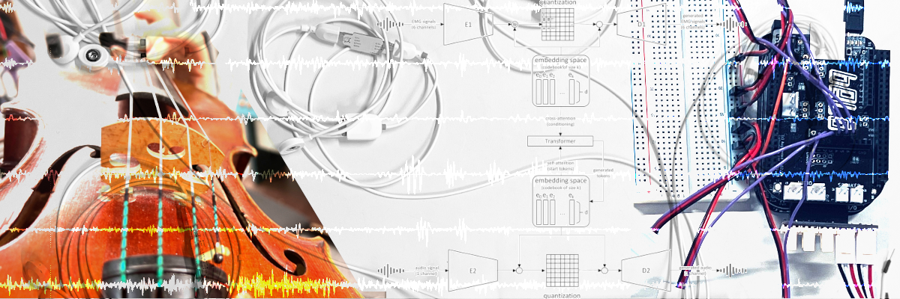

This webpage features audio and visual examples for the following publication:

Strauss, L., Thattai Ravikumar, P., Yee-King, M. ‘Cross-Modal Sig2Sig Machine Translation with Deep Generative Modeling for NIME Design’. International Conference on New Interfaces for Musical Expression, 2026.

[`GitHub`](https://github.com/lucystrauss/MLMLMLM): MLMLMLM GitHub Repository

[`Music`](https://lucystrauss.com/mlmlmlm): Artistic Research Project Page

[`This Page`](https://lucystrauss.github.io/NIME_2026_examples/): Listening Examples

## EA Experiments

Below is a tabulation of model outputs from the interim training phase, corresponding to Tables 3 & 4, Section 6.1 in the associated publication. Each playback features four pairs of original and reconstructed signals. Original and reconstructed samples are interleaved.

<b>BEWARE OF SUDDEN LOUD CLICKS!!! LISTEN TO EACH SAMPLE WITH LOW VOLUME FIRST!!!</b>

| EA VAE 1 | epoch 113 | <audio controls preload=False><source src="./audio/paired/EA_VAE1_audio_113.wav" type="audio/wav">Audio not supported by your browser.</audio> |
| EA VAE 2 | epoch 96 | <audio controls preload=False><source src="./audio/paired/EA_VAE2_audio_96.wav" type="audio/wav">Audio not supported by your browser.</audio> |
| EA VAE 3 | epoch 96 | <audio controls preload=False><source src="./audio/paired/EA_VAE3_audio_96.wav" type="audio/wav">Audio not supported by your browser.</audio> |
| EA VAE 3 | epoch 113 | <audio controls preload=False><source src="./audio/paired/EA_VAE3_audio_113.wav" type="audio/wav">Audio not supported by your browser.</audio> |
| EA VAE 4 | epoch 113 | <audio controls preload=False><source src="./audio/paired/EA_VAE4_audio_113.wav" type="audio/wav">Audio not supported by your browser.</audio> |

## MLMLMLM Outputs

The following listening examples are model outputs using the full MLMLMLM architecture, composed of two RVQ-VAEs and a Transformer decoder in latent space. In TE1, the cross-attention causal mask and kv caching were not yet implemented. TE2 outputs are truly causal and autoregressive with streaming conditioning, as described in Section 7 of the associated publication.

| TE1 | epoch 100 | <audio controls preload=False><source src="./audio/transformer/T1_100_epochs.wav" type="audio/wav">Audio not supported by your browser.</audio> |
| TE1 | epoch 99 | <audio controls preload=False><source src="./audio/transformer/TE1_99_epochs.wav" type="audio/wav">Audio not supported by your browser.</audio> |
| TE1 | epoch 98 | <audio controls preload=False><source src="./audio/transformer/TE1_98_epochs.wav" type="audio/wav">Audio not supported by your browser.</audio> |
| TE1 | epoch 97 | <audio controls preload=False><source src="./audio/transformer/TE1_97_eopchs.wav" type="audio/wav">Audio not supported by your browser.</audio> |

| TE2 | epoch 100 | <audio controls preload=False><source src="./audio/transformer/T2_100_epochs.wav" type="audio/wav">Audio not supported by your browser.</audio> |
| TE2 | epoch 99 | <audio controls preload=False><source src="./audio/transformer/TE2_99_epochs.wav" type="audio/wav">Audio not supported by your browser.</audio> |
| TE2 | epoch 98 | <audio controls preload=False><source src="./audio/transformer/TE2_98_epochs.wav" type="audio/wav">Audio not supported by your browser.</audio> |
| TE2 | epoch 97 | <audio controls preload=False><source src="./audio/transformer/TE2_97_epochs.wav" type="audio/wav">Audio not supported by your browser.</audio> |
